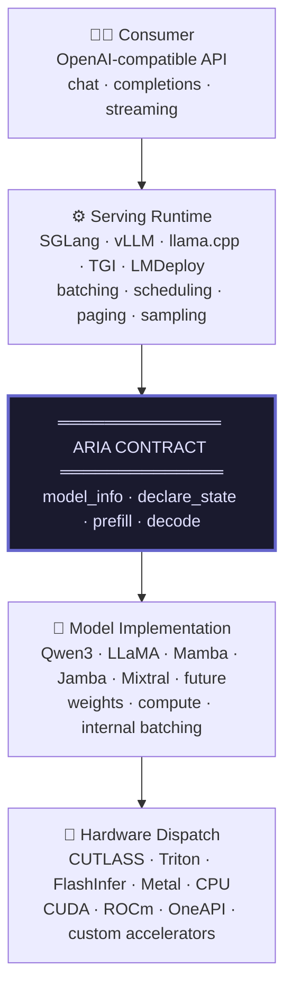
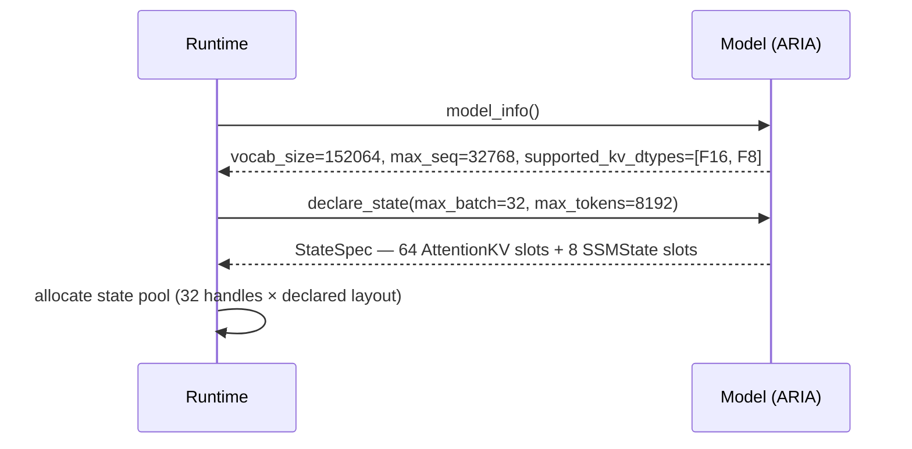
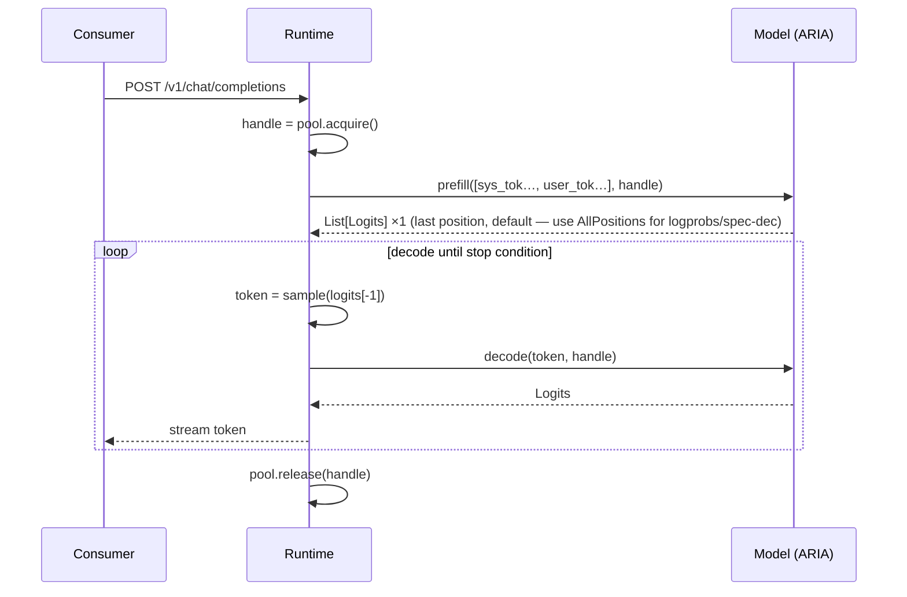
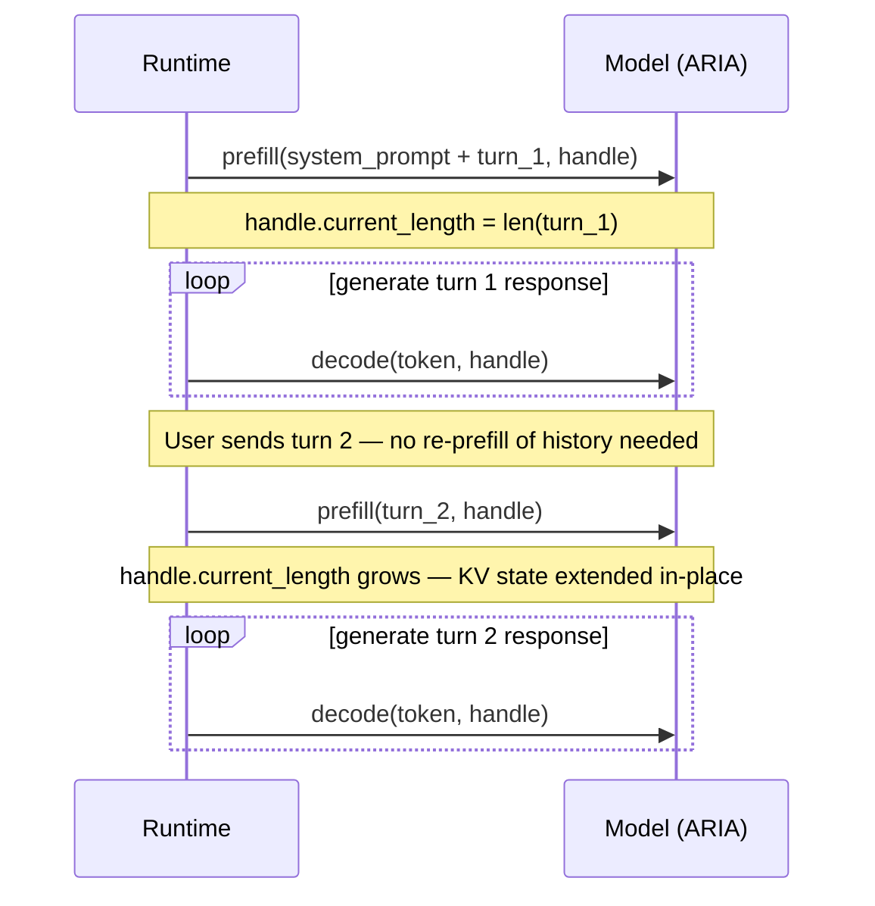
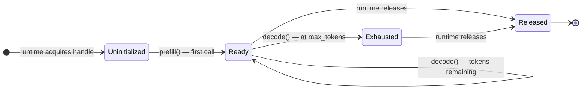

# ARIA — Agnostic Runtime Inference Abstraction

> *A minimal, vendor-neutral contract between language model implementations and serving runtimes.*

**[Read the Spec →](spec/ARIA-0.6-draft.md)** | Status: Draft 0.6 | License: CC BY-SA 4.0

---

## The Problem

Every major LLM serving framework — vLLM, SGLang, llama.cpp, TGI, LMDeploy — independently
implements the same internal machinery: KV cache managers, state allocators, batching logic.
And every time a new model architecture ships, all of them break and have to be updated.

```
GPT-style attention  →  every framework builds a KV cache manager
Mamba / SSM ships    →  every framework rebuilds for recurrent state (completely different!)
Hybrid attention+SSM →  every framework reimplements both, wired together, per-architecture
MoE routing changes  →  every framework updates expert dispatch and memory accounting
```

This is not a coincidence. It is a structural coupling problem.

### The Root Cause

Serving frameworks are tightly coupled to model internals. They know about attention head
counts, KV cache shapes, SSM state dimensions — implementation details they have no
architectural reason to know. The model's internals are not behind an interface; they are
directly referenced in framework code.

This violates four SOLID principles simultaneously:

| Principle | Violation |
|-----------|-----------|
| Open/Closed | New architecture = modify framework internals |
| Liskov Substitution | Models are not substitutable; each requires bespoke handling |
| Interface Segregation | Framework consumes model internals it never needs |
| Dependency Inversion | Framework depends on model concretions, not abstractions |

### What the Ecosystem Is Missing

All existing specifications fail at the same point:

| Spec | The Gap |
|------|---------|
| ONNX | Static graph — cannot express mutable recurrent state |
| WASI-NN | Inference contract is stateless — no per-request state lifecycle |
| GGUF | File format + C++ compute contract; arch-specific code still required |
| TIS backend API | Good serving contract; no stateful decode standardization |
| HF `generate()` | Python-only; exposes model internals |

The missing piece that none of them provide: **a standard where the model declares its state
requirements and the runtime allocates them opaquely.** For pure-attention models this is a
convenience. For hybrid attention+SSM models it is the only way to handle heterogeneous state
types without bespoke framework code.

---

## The Solution

ARIA defines two interfaces:

```
interface ILanguageModel {
    ModelInfo    model_info()
    StateSpec    declare_state(max_batch, max_tokens)
    List[Logits] prefill(tokens, state, mode=LastPosition)
    List[Logits] prefill(batch)                            // batch overload
    Logits       decode(token, state)
    List[Logits] decode(batch)                             // batch overload
}

interface ITokenizer {
    List[TokenId]        encode(text)
    List[List[TokenId]]  encode(batch)                     // batch overload
    String               decode(tokens)
    List[String]         decode(batch)                     // batch overload
    UInt32               vocab_size()
    Map[String, TokenId] special_tokens()
}
```

**The model** declares what state it needs — shape, dtype, semantic role — and ships a
default `ITokenizer`. **The runtime** allocates state, owns handle lifecycle, and may
substitute an optimized tokenizer implementation. **Neither side looks inside the other.**

That's the entire contract.

---

## Architecture



The ARIA line is the **only boundary** that needs to be stable. Everything above and below it
is free to evolve.

---

## How It Works

### 1. Load Time (once per model)



### 2. Per Request



### 3. Multi-Turn Conversation (KV state preserved)



---

## State Lifecycle



---

## What Makes This Different

### The Semantic Tag System

The core of ARIA is not the three methods — it's the `SemanticTag` on each state slot.

```
AttentionKV { layer_idx, is_key, window_size? }
  → Runtime may: page it, prefix-share it, evict stale pages (if windowed)
  → Model guarantee: append-only writes

SSMState { layer_idx }
  → Runtime must: preserve exact values, no paging, no eviction
  → Model guarantee: fully overwrites on every call (constant-size recurrent state)

Opaque { description }
  → Runtime must: allocate as declared, preserve exactly
  → For model-defined state that fits neither above category
```

The runtime never needs to understand attention math or SSM dynamics. It just needs to know
*how to manage the memory*. Tags communicate role without exposing implementation.

### Heterogeneous State — The Hybrid Model Problem

Pure-attention models (GPT, LLaMA, Qwen3) only need `AttentionKV` slots.  
Pure-SSM models (Mamba) only need `SSMState` slots.  
Hybrid models (Jamba, Zamba, Qwen3-Coder-Next) need **both simultaneously**.

Every framework today requires bespoke code for hybrid models. ARIA handles them naturally —
`declare_state()` just returns a mix of slot types and the runtime allocates accordingly.

Validated on production hardware (NVIDIA GB10/SM121):

| Model | Architecture | ARIA State Profile |
|-------|-------------|-------------------|
| Qwen3-Coder-Next FP4 | Mamba+Attention hybrid | SSMState × N + AttentionKV × M |
| Qwen3-30B-A3B FP4 | MoE Transformer | AttentionKV × L |
| Qwen3-14B BF16 | Dense Transformer | AttentionKV × L |

---

## Innovation Freedom

ARIA's contract is deliberately narrow. **It does not constrain innovation — it protects it.**

**Model implementors keep full freedom to:**
- Use any attention algorithm (FlashAttention, FlashInfer, xFormers, custom)
- Use any weight quantization (FP4, FP8, INT4, BF16, mixed)
- Use any architecture (attention, SSM, hybrid, MoE, sparse, future)
- Use any positional encoding (RoPE, ALiBi, NoPE, custom)
- Implement tensor / pipeline parallelism internally and transparently
- Capture CUDA graphs, use custom kernels, target any hardware
- Batch concurrent `decode()` calls into a single GPU kernel internally

**Runtime implementors keep full freedom to:**
- Use any paging strategy (PagedAttention, virtual addressing, contiguous)
- Use any eviction policy (LRU, LFU, SLO-aware, learned)
- Use any batching and scheduling strategy (continuous, static, priority)
- Implement prefix caching (RadixAttention, hash-based) transparently
- Quantize KV cache within the model's declared supported range
- Implement speculative decoding (draft + target model, both ARIA instances)
- Use any sampling strategy (temperature, top-p, beam, guided)
- Implement LoRA / adapter management without model changes

The ARIA boundary means that when vLLM ships a new scheduling algorithm, no model changes.
When a new architecture ships, no framework changes. When hardware changes, neither changes.

---

## Comparison

| Feature | ARIA 0.5 | ONNX | WASI-NN | GGUF | TIS Backend | HF generate() |
|---------|:---:|:---:|:---:|:---:|:---:|:---:|
| Stateful autoregressive decode | ✅ | ❌ | ❌ | Partial | ❌ | ✅ |
| Heterogeneous state (KV + SSM) | ✅ | ❌ | ❌ | Partial | ❌ | Partial |
| Runtime-managed allocation | ✅ | ❌ | ❌ | ❌ | ❌ | Partial |
| Multi-call prefill | ✅ | ❌ | ❌ | ❌ | ❌ | ✅ |
| Speculative decoding support | ✅ | ❌ | ❌ | ❌ | ❌ | ✅ |
| KV dtype negotiation | ✅ | N/A | N/A | N/A | ❌ | Partial |
| Architecture-agnostic | ✅ | Partial | ✅ | ❌ | Partial | ❌ |
| Language-agnostic | ✅ | ✅ | ✅ | ❌ | Partial | ❌ |
| Vendor-neutral | ✅ | ✅ | ✅ | ✅ | ❌ | ❌ |
| Full error taxonomy | ✅ | ❌ | ❌ | N/A | Partial | ❌ |

---

## Status and Roadmap

**ARIA 0.5-draft**
- Decoder-only autoregressive language models
- Discrete token vocabulary
- `AttentionKV`, `SSMState`, `Custom` semantic tags
- KV dtype negotiation
- Multi-call prefill (chunked prefill, multi-turn)
- Full error taxonomy with fatal/retriable classification

**ARIA 1.1 (planned)**
- `BatchProfile` — explicit batch coordination interface for co-designed model-runtime pairs
- `CrossAttentionKV` tag — encoder-decoder support
- Speculative decoding tree attention
- LoRA / adapter interface
- `truncate()` operation for context extension (llama.cpp context shifting)
- Conformance tiers

**ARIA 2.0 (future)**
- Multimodal inputs (vision, audio)
- Multi-node distributed inference contract

---

## Specification

→ **[`spec/ARIA-1.0-draft.md`](spec/ARIA-1.0-draft.md)** — full specification

Includes: type system, complete interface definition, semantic tag obligations, StateHandle
lifecycle, KV dtype negotiation, error model with fatal/retriable taxonomy, invariants,
design rationale, framework compatibility notes (vLLM, SGLang, llama.cpp, TGI, LMDeploy),
and a reference implementation skeleton.

---

## Contributing

ARIA is in active draft. Discussion, critique, and implementation reports are welcome.

Open an issue to:
- Report a gap or ambiguity in the spec
- Propose a new semantic tag
- Report an implementation experience (conforming or non-conforming)
- Propose a binding (Python, Rust, C) for standardization

---

*ARIA is an open specification. HaiberDyn originated it and implements it internally.  
We intend to publish it as an open RFC and seek neutral stewardship as it matures.*
